

  

<h1>Active Directory - High Level Installation and Deployment</h1>

> [!Important]
> If starting from this walk-through, it's best to go back to the previous setup to get the full breakdown of configurations for the virtual machines used in this demonstration.

- Microsoft Azure
- Remote Desktop Protocol
- Windows Server 2022

<h2>Operating Systems Used</h2>

<h2>List of Prerequisites</h2>

- Microsoft Azure Account
- 2 Virtual Machines

<h2>High-Level Deployment and Installation Steps</h2>

> [!Important]
> Each step will include written instructions and corresponding screenshots. Expand the "See screenshots" section to view the images and progress through the portfolio.

<h3>1. Log into Domain Controller VM</h3>

So the first thing i'm going to do is to log into DC-1 VM. To do that, get the public IP address of DC-1 and open up remote desktop. The easiest way to do that is to press the start key and type in remote desktop. Once it's open, type in the the ip address and log in using the credentials of dc-1.

See screenshots

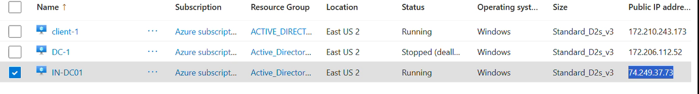

See screenshots

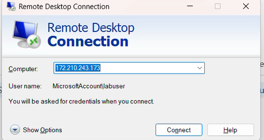

See screenshots

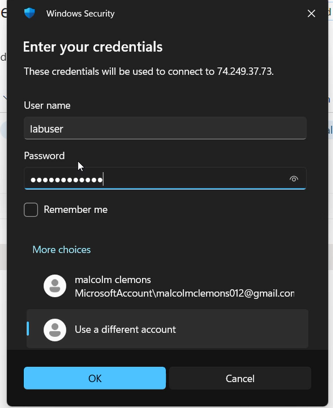

Upon logging into the DC-1 VM, the windows server manager screen will appear and from here, this is where i'm going to start the installation of Active Directory.

<h4>2. Installation of Active Directory</h4>

So in order to start the AD installation, I'm going to click on add roles and features. Once I click on that button, a list of services will appear and from that list, I'm going to click on Active Directory Domain Services.

See screenshots

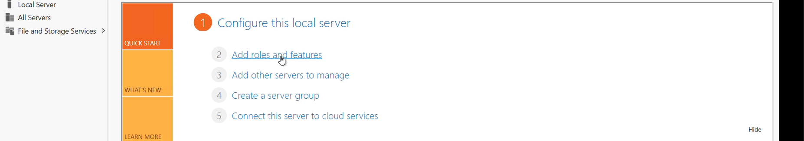

So in order to start the AD installation, I'm going to click on add roles and features.

See screenshots

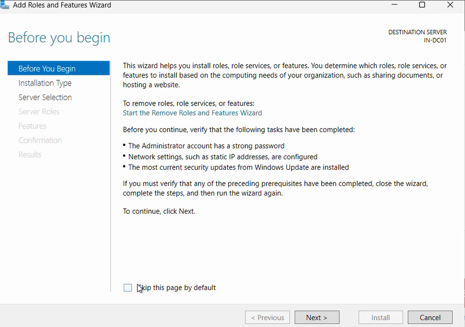

On the before you begin screen, just click to continue to the select installation type screen

See screenshots

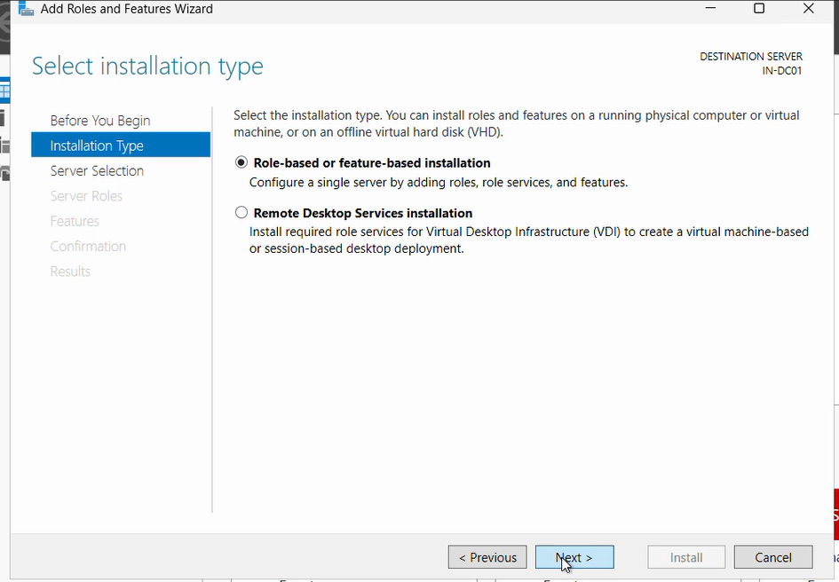

On this screen, make sure the role-based install is selected and click continue

See screenshots

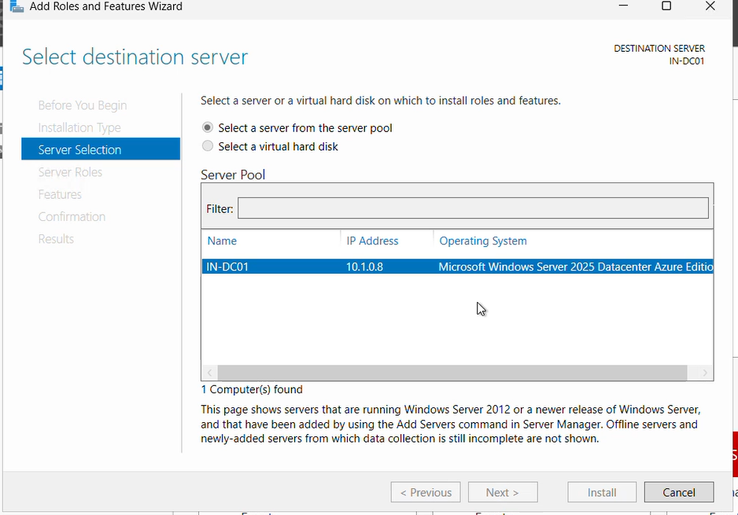

You'll get to the select destination server screen and on this screen, choose the select server from server pool option and choose your server. In my case, I only have one server to choose from.

See screenshots

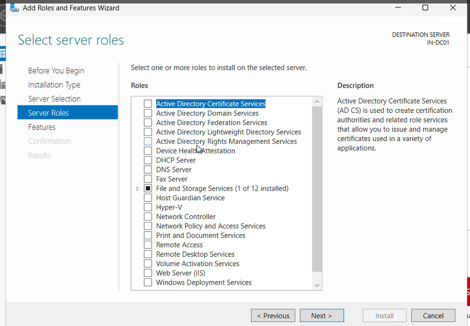

On the server role screen,I'm going to choose the active directory domain services for the server role.

See screenshots

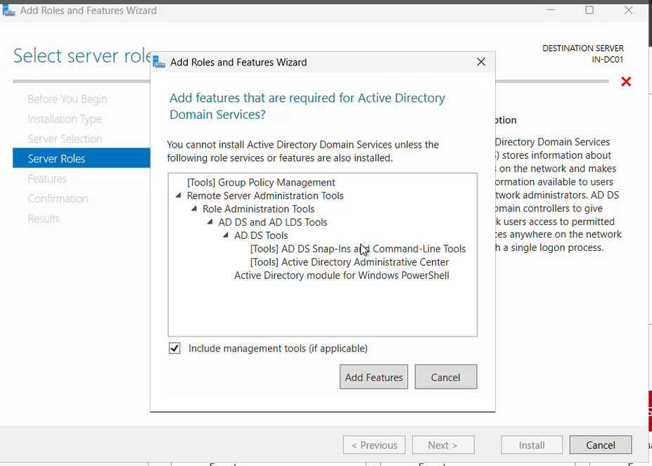

See screenshots

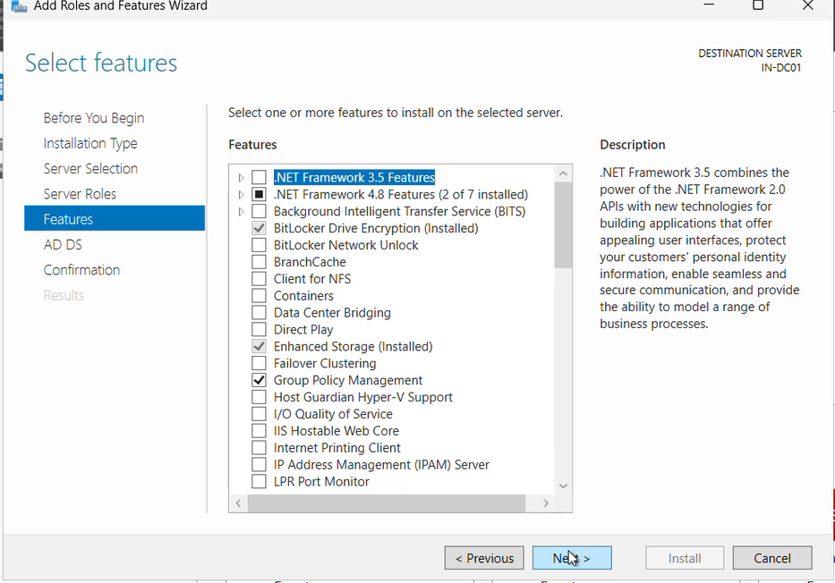

See screenshots

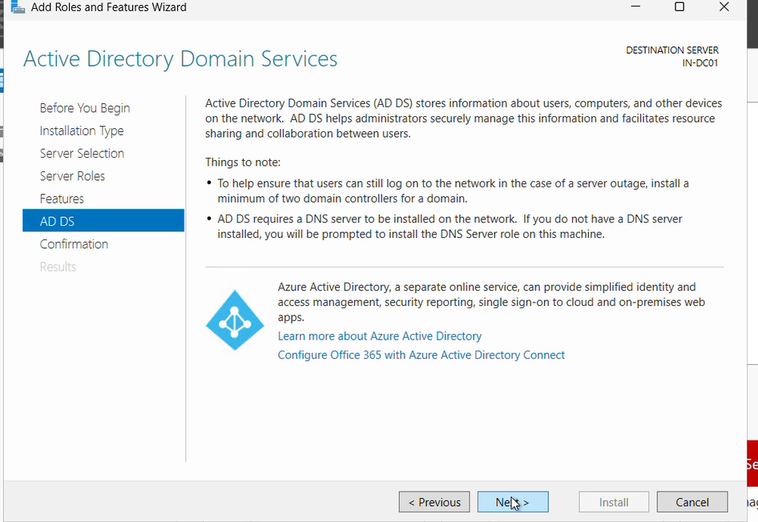

See screenshots

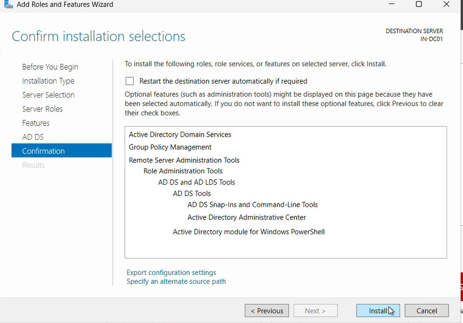

See screenshots

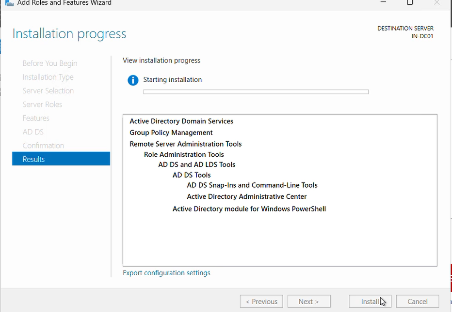

